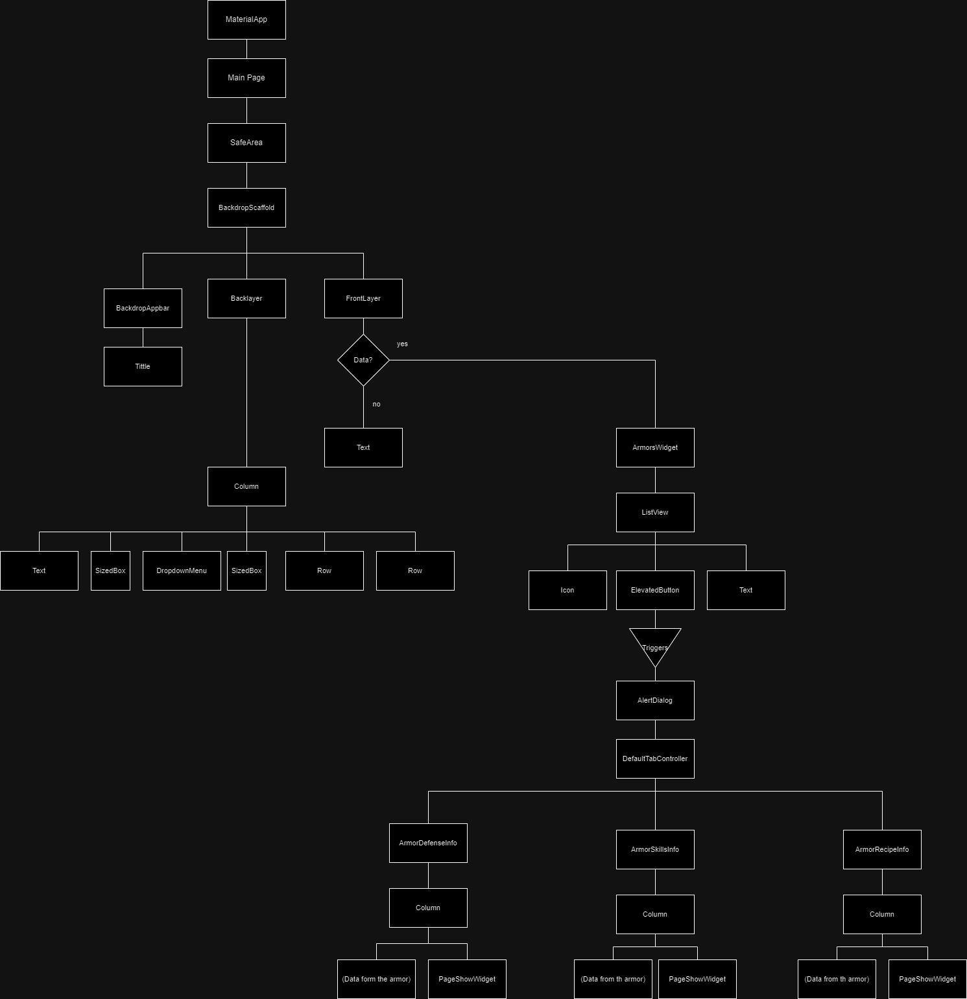
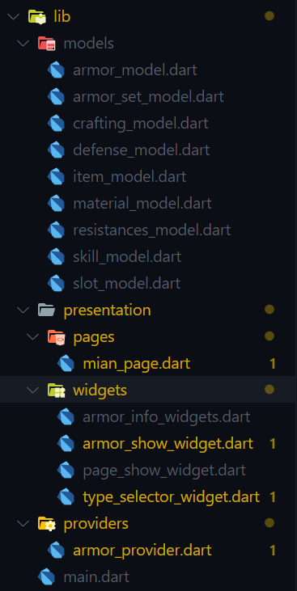
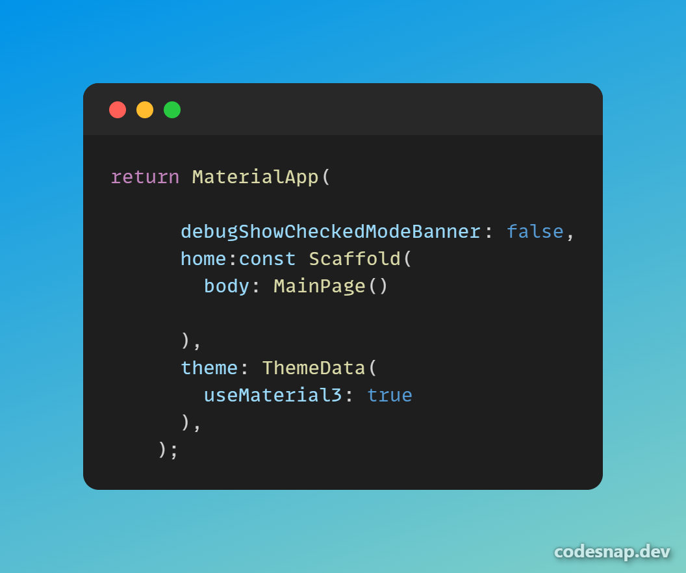
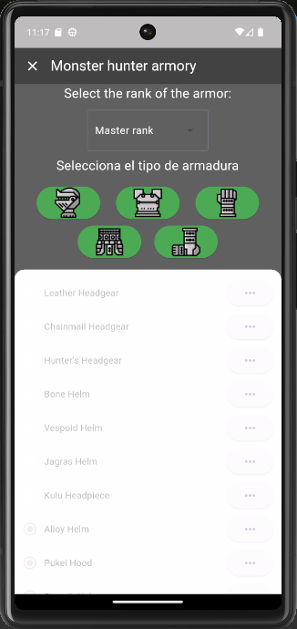
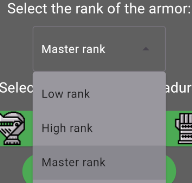
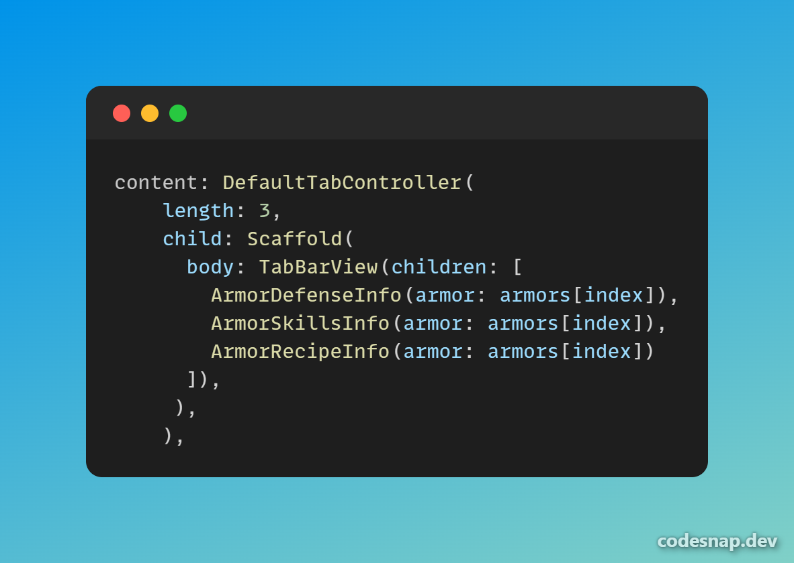
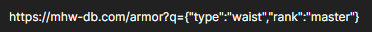

# Monster hunter armor data

Proyecto de flutter creado para la asignatura de móviles, se trata de la práctica obligatoria 2 de la signatura, el proposito de la práctica es probar diferentes widgets y soltarse con el uso de flutter

## Estructura del proyecto

La estructura de widgets del proyecto es la siguietne: 

La estructura del propio proyecto es la siguiente (distribución de las carpetas):

#### Models

En esta carpeta van los modelos que estoy utilzando en la aplicación

#### Presentation

En esta carpeta va cualquier widget, página o vista

##### Pages, widgets

En la carpeta Pages van las páginas que uso y en la carpeta Widgets los widgets que he creado para segmentar el código

#### Providers

En esta carpeta van los providers que se encargan de traer la información de la api

#### Main

Es el fichero principal del proyecto desde el que se inicia la aplicación

## Widgets usados
A continuación voy a hacer una breve explicación de los widgets que he utilizado, explicaré los widgets que tienen algo de complejidad o he utilizado algo que, crea oportuno explicar.

### MaterialApp
Es el widget principal de la aplicación, para este proyecto estoy usando un scaffold en el que va la página principal, estoy usando Material3

### Backdrop Scaffold

Este widget es un scaffold diferente para poder utilizar un desplegable en la appbar, desde el que realizo la busqueda de las armaduras, así es como se ve en la aplicación

El backdrop scaffold tiene dentro 3 partes:

- Appbar, es el appbar común
- Backlayer, es el desplegable que se ve en la imagen
- FrontLayer, es donde se muestra el contenido principal

### Dropdown menu

Este widget lo he usado para hacer lo que viene a ser un options en html convencional, para seleccionar entre campos

El dropdown menu recibe los siguietnes parametros:

- dropdownMenuEntries, las opciones que tendrá, como lista
- initialSelection, el elemento que vendrá seleccionado por defecto
- onSelected, la función que se realizará al seleccionar un elemento

_A parte dee estos parametros, he usado más parametros para el estilo de este_

### Elevated button

Este widget es simple, sólo es un botón pero quiero explicar que es la forma que tengo de traer los datos, al pulsar un botón se pide la información del tipo de armadura correspondiente a este, del rango que hay seleccionado en el DropdownMenu

### ListView

Este widget es una lista scrolleable, que genero a partir de los datos de las armaduras en mi caso esta dentro de un widget que he creado para separar el codigo, llamado ArmorsWidget, al que le paso la lista de armaduras que quiero representar

En mi caso utilizo ListView.builder() para que sea más comodo crear la lista, Listview.builder() recibe los siguientes parametros:

- itemCount:  Número e items que tendrá la lista
- itemBuilder: El builder que construira cada una de la filas de la lista

Dentro de cada una de las casillas hay un icono que se colorea de un color dependiendo de la rareza de la armadura, un texto con el nombre de la armadura y un botón que abre un menú en el cual hay información más detallada de esta

### AlertDialog

Para crear el AlertDialog, lo he insertado en el onpressed de los botones de la lista con el metodo showDialog, dentro de un builder.

Un AlertDialog tiene los siguietnes parametros ( En mi caso ):

- Content padding: Padding normal y corriente
- Content: El contenido del dialogo ( siguietne widget )

### DefaultTabController

Es un widget que permite tener varias páginas dentro de una scrolleando hacia izquierda y derecha, lo utilizo dentro del alert dialog para mostrar diferente información de la armadura.

Recibe como parametros:

- Length: el número de páginas que vas a tener
- child: Un scaffold, el cual en el body tiene un TabBarView el cual tiene una lista con las 3 páginas que quiero mostrar

_Ya que esto pueede ser un poco confuso adjunto imagen_

Como se puede observar dentro del conetnido hay 3 widgets creados manualmente, los cuales son una columna con los datos correspondientes a defensa, habilidades de la armadura y receta de esta.

### PageShowWidget

Este es un widget que he creado yo mismo para mostrar la ventana de la información de la armadura en la que nos encontramos, tiene 3 container y uno de ellos se hace más grande dependiendo del número que le pasemos a la hroa de crearlo.

Está hecho con containers y hacen una comprobación en su parametro width

Queda así:

## Api usada

He usado la api de [Monster Hunter World API](https://docs.mhw-db.com) una api del videojuego monster hunter world, en concreto de la parte de las armaduras, es una api peculiar ya que para hacer las busquedas introduce dentro de la query un objeto con los parametros con los que queremos buscar, en mi caso las querys tenian esta pinta:

_Le estoy pidiendo los cinturones de rango maestro, (hay muchos más campos por los que se puede buscar)_